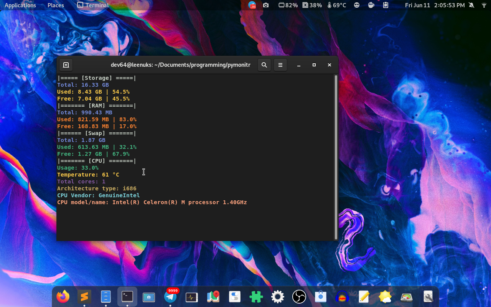

# PyMonitr, a simple system monitor for your linux computer!
### **Do you want to monitor your RAM, storage, swap & CPU usage easily & quickly? PyMonitr is here for you!!**
### **With PyMonitr you can:**
1. **Monitor your RAM, CPU, storage ('/') & swap usage,**
2. **Get information about your CPU, such as:**
+ **Usage,**
+ **Temperature,**
+ **Total cores,**
+ **Architecture type,**
+ **CPU vendor &**
+ **CPU model**

# Screenshot:
### ***Yes, these infos are REAL, theyre not fake or modified!!***

# Requirements
### **[psutil](https://pypi.org/project/psutil/) and [colorhex](https://pypi.org/project/colorhex/) are required, otherwise this program cant run lol**
### **install using:**
+ **pip3 install psutil colorhex**

# Which file to use
### **Now there are a lot of files/different versions, but i suggest you to use the latest, which is 8!**

# ***lol***
### **I know, the code looks pretty bad, and there could be a lot of ways to make it better, but IM NOT experienced, ***so please dont make fun of me,*** but tell how i could fix & make it better**# PyMonitr, a simple system monitor for your linux computer!
### **Do you want to monitor your RAM, storage, swap & CPU usage easily & quickly? PyMonitr is here for you!!**
### **With PyMonitr you can:**
1. **Monitor your RAM, CPU, storage ('/') & swap usage,**
2. **Get information about your CPU, such as:**
+ **Usage,**
+ **Temperature,**
+ **Total cores,**
+ **Architecture type,**
+ **CPU vendor &**
+ **CPU model**

# Screenshot:
### ***Yes, these infos are REAL, theyre not fake or modified!!***

# Requirements
### **[psutil](https://pypi.org/project/psutil/) and [colorhex](https://pypi.org/project/colorhex/) are required, otherwise this program cant run lol**
### **install using:**
+ **pip3 install psutil colorhex**

# Which file to use
### **Now there are a lot of files/different versions, but i suggest you to use the latest, which is 8!**

# ***lol***
### **I know, the code looks pretty bad, and there could be a lot of ways to make it better, but IM NOT experienced, ***so please dont make fun of me,*** but tell how i could fix & make it better**
