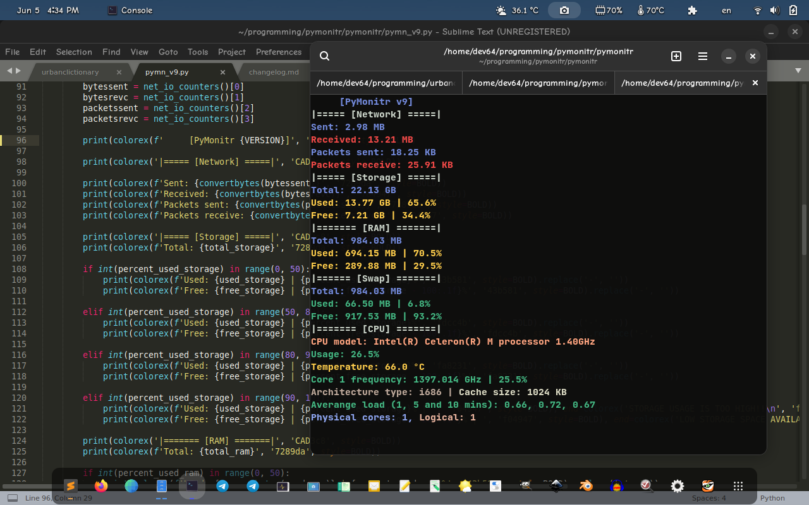

# PyMonitr, a simple system monitor for linux

using [psutil](https://pypi.org/project/psutil/) and [colorhex](https://pypi.org/project/colorhex/)

With PyMonitr you can:
1. **Monitor your RAM, CPU, storage ('/', removed in v9) & swap usage,**
2. **and get information about your CPU, such as:**
+ **Usage,**
+ **Temperature,**
+ **Total logical & non logical cores,**
+ **Architecture type,**
+ **CPU vendor &**
+ **CPU model**

# screenshots:

# requirements
**[psutil](https://pypi.org/project/psutil/), [colorhex](https://pypi.org/project/colorhex/), [cursor](https://pypi.org/project/cursor)**

**pip3 install psutil colorhex cursor**

# usage
`./pymn_v9.py -OPTIONS`

available options: -r (refresh time). default value: 1

# note
im tired working for this, ive worked so hard and for a long time, but i didnt made it stable, i can fix it, but i dont want to. 9 is the last version of pymonitr, which was made MONTHS ago, i just decided to upload it now, and from this day, i stop updating pymonitr. please use [sysmon](https://github.com/devlocalhost/sysmon) instead, a better version of pymonitr